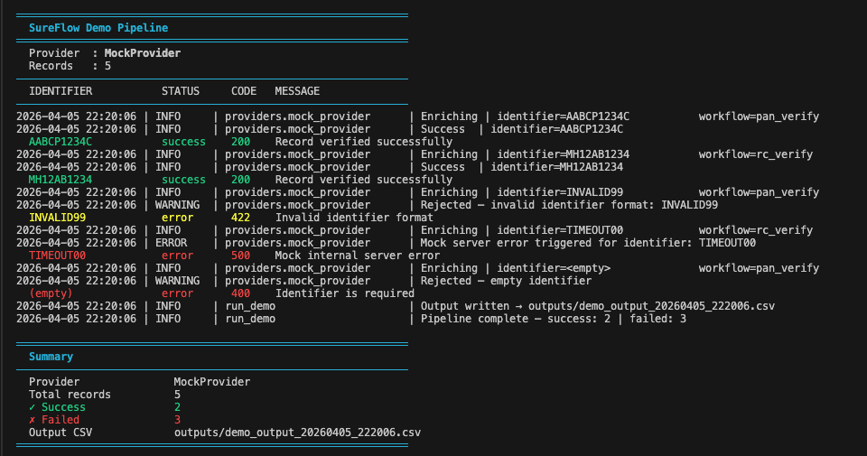

<div align="center">


</div>

<div align="center">


</div>

---

## 👨‍💻 Built By

**Dheeraj Kandpal** — Data & Backend Engineer at [Surepass](https://surepass.io)

This project came directly from production experience: I process thousands of identity verification records daily (PAN, RC, GST, MCA) at Surepass using batch Python pipelines. SureFlow is the clean, open-source version of that architecture — built to show how real data engineering systems should be designed.

> *Not a tutorial project. Not a toy. A production pattern — fully runnable offline.*

---

## 📌 What This Project Does

SureFlow is a **batch data enrichment pipeline** that takes a CSV of identity records, sends each one through a verification provider (KYC API), and outputs a clean, auditable results CSV — with full logging, error handling, and status codes per record.

```
inputs/records.csv  →  Provider Layer  →  outputs/results_20260405.csv
    (PAN, RC, GST)      (Mock or Real)      (status, message, data per row)
```

**The problem it solves:** Organisations processing large volumes of identity documents need a pipeline that handles API failures gracefully, works offline during development, produces clean audit trails, and can swap providers without changing business logic. This does all of it.

---

## 📸 Demo



---

## ⚡ Key Features

| Feature | What it means |
|---------|---------------|
| 🔌 **Pluggable provider architecture** | Swap Mock ↔ Real API with a single `.env` flag — zero code changes |
| 🟢 **Full offline demo mode** | Runs completely without API credentials — deterministic mock responses |
| 📊 **Batch CSV processing** | Reads any CSV, enriches every row, writes timestamped output |
| 🛡️ **Consistent response schema** | Every provider returns identical `{status, status_code, message, error, data}` |
| 📋 **Structured logging** | Every record logged to `stdout` + `logs/app.log` |
| 🌐 **FastAPI REST backend** | Full API server with job management and async worker |
| 🔐 **Auth & RBAC** | Role-based access, optional Google Sign-In |
| 💾 **SQLite → PostgreSQL** | Single-file DB for dev, production-ready Postgres config |

---

## 🏗️ Architecture

```
run_demo.py
    └── get_provider()              ← reads DEMO_MODE from .env
            ├── DEMO_MODE=true  →  MockProvider   (offline, deterministic)
            └── DEMO_MODE=false →  RealProvider   (live API, needs token)
                    └── enrich(record) → { status, status_code, message, error, data }
```

### Folder Structure

```
sureflow-data-enrichment/
│
├── providers/                  ← Core abstraction layer
│   ├── base.py                 ← BaseProvider — abstract contract
│   ├── mock_provider.py        ← Offline demo, no credentials needed
│   ├── real_provider.py        ← Stub ready for live API wiring
│   └── factory.py              ← get_provider() — DEMO_MODE switch
│
├── server/
│   ├── main.py                 ← FastAPI app + REST endpoints
│   └── worker.py               ← Async batch worker
│
├── src/
│   ├── api/surepass_client.py  ← External API HTTP client
│   ├── db/                     ← Database helpers
│   ├── models/                 ← Pydantic data models
│   └── utils/                  ← Shared helpers
│
├── utils/logger.py             ← Centralised logging
├── inputs/sample.csv           ← 5 sample test records
├── run_demo.py                 ← START HERE — demo pipeline runner
├── test_provider.py            ← Quick smoke test
└── .env.example                ← Safe environment template
```

### Standardised Response Schema

Every provider — Mock or Real — returns the exact same shape:

```json
{
    "status":      "success",
    "status_code": 200,
    "message":     "Record verified successfully",
    "error":       null,
    "data": {
        "identifier": "AABCP1234C",
        "workflow":   "pan_verify",
        "status":     "verified",
        "provider":   "mock"
    }
}
```

This is the key design decision — the rest of the pipeline never needs to know which provider ran.

---

## 🚀 Quick Start

```bash
# 1. Clone and install
git clone https://github.com/DheerajKandpal/sureflow-data-enrichment.git
cd sureflow-data-enrichment
pip install -r requirements.txt

# 2. Configure (demo mode is already on — no API keys needed)
cp .env.example .env

# 3. Run
python run_demo.py
```

### Expected Output

```
══════════════════════════════════════════════════════════════
  SureFlow Demo Pipeline
══════════════════════════════════════════════════════════════
  Provider  : MockProvider
  Records   : 5
────────────────────────────────────────────────────────────
  IDENTIFIER      STATUS     CODE   MESSAGE
────────────────────────────────────────────────────────────
  AABCP1234C      success    200    Record verified successfully
  MH12AB1234      success    200    Record verified successfully
  INVALID99       error      422    Invalid identifier format
  TIMEOUT00       error      500    Mock internal server error
  (empty)         error      400    Identifier is required
══════════════════════════════════════════════════════════════
  ✓ Success: 2   ✗ Failed: 3   Output: outputs/demo_output_*.csv
══════════════════════════════════════════════════════════════
```

---

## 🔌 Demo Mode vs Real Mode

| | `DEMO_MODE=true` | `DEMO_MODE=false` |
|---|---|---|
| Provider | MockProvider | RealProvider |
| Credentials | ❌ None needed | ✅ Surepass token |
| Behaviour | Deterministic offline responses | Live API calls |
| Use case | Dev, testing, portfolio demo | Production |

**Mock simulation rules:**

| Input Pattern | Code | Result |
|---|---|---|
| Contains `INVALID` or ends with `99` | 422 | Invalid identifier |
| Contains `ERROR` or ends with `00` | 500 | Server error |
| Empty string | 400 | Missing identifier |
| Anything else | 200 | ✅ Verified |

---

## 📊 Sample Input → Output

**`inputs/sample.csv`**

| identifier | workflow | note |
|---|---|---|
| AABCP1234C | pan_verify | Valid PAN |
| MH12AB1234 | rc_verify | Valid RC number |
| INVALID99 | pan_verify | Triggers 422 |
| TIMEOUT00 | rc_verify | Triggers 500 |
| *(empty)* | pan_verify | Triggers 400 |

**`outputs/demo_output_*.csv`** — one row per input with full status, message, and JSON data.

---

## 🌐 Running the API Server

```bash
# Start FastAPI backend
uvicorn server.main:app --reload --host 127.0.0.1 --port 8000

# Health check
curl http://127.0.0.1:8000/api/health
```

---

## 🔑 Connecting a Real Provider

1. Set `DEMO_MODE=false` in `.env`
2. Set `SUREPASS_PRIMARY_TOKEN=<your_jwt>` in `.env`
3. Open `providers/real_provider.py` → replace the stub with the `httpx` call

No other files change. The provider interface is the only contract everything else depends on.

---

## 🛠️ Tech Stack

| Layer | Technology |
|-------|-----------|
| Language | Python 3.11 |
| API Framework | FastAPI + Uvicorn |
| Data Processing | pandas, csv (stdlib) |
| HTTP Client | httpx |
| Validation | pydantic v2 |
| Database | SQLite (dev) / PostgreSQL (prod) |
| Logging | Python stdlib logging |
| Environment | python-dotenv |

---

## 🔒 Security Practices

- `.env` is gitignored — never committed. `.env.example` is the safe onboarding template
- `inputs/` is gitignored except `sample.csv` — real client data never enters the repo
- `outputs/` and `logs/` are gitignored — only artefacts, never source data
- All tokens read from env at runtime — zero hardcoded secrets anywhere

---

## 📬 Connect

<div align="center">

[](https://linkedin.com/in/dheerajkandpal)
[](https://github.com/DheerajKandpal)
[](mailto:dheeraj.kandpal@surepass.io)

</div>

---

<div align="center">

<sub>Built from real production experience at Surepass · Python · FastAPI · Pluggable architecture · Fully offline demo</sub>
</div>
